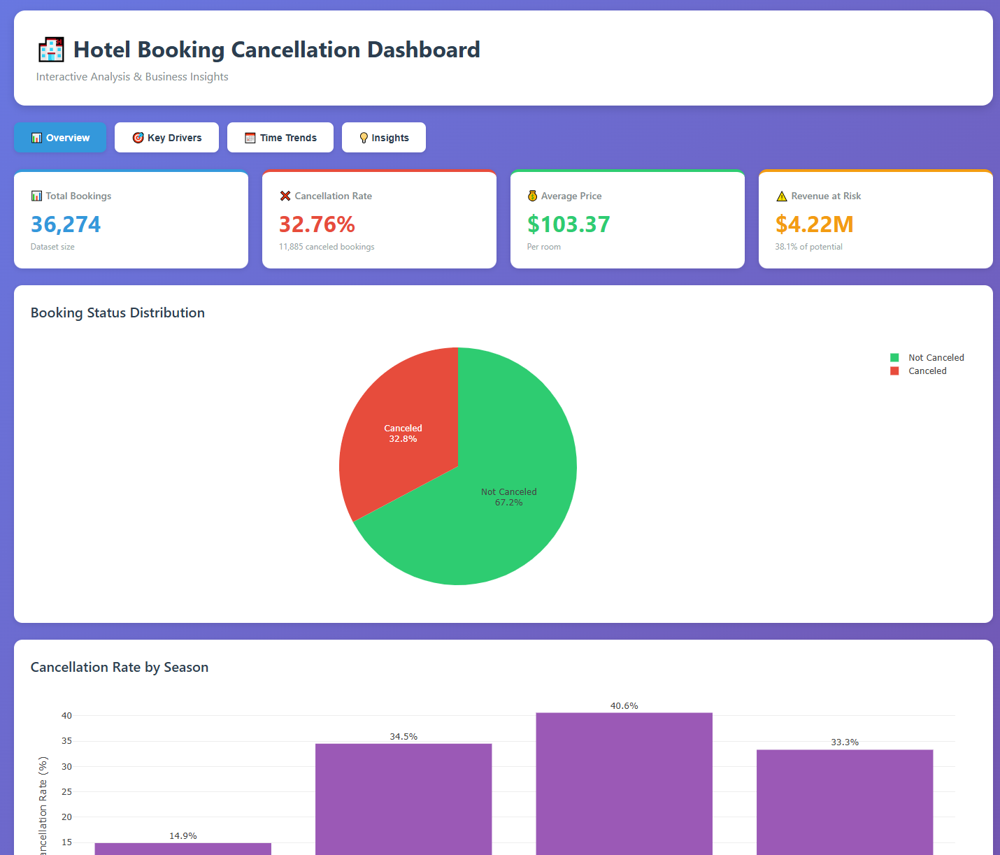
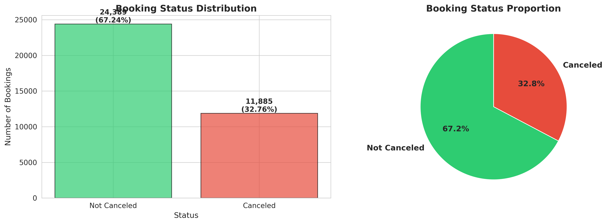
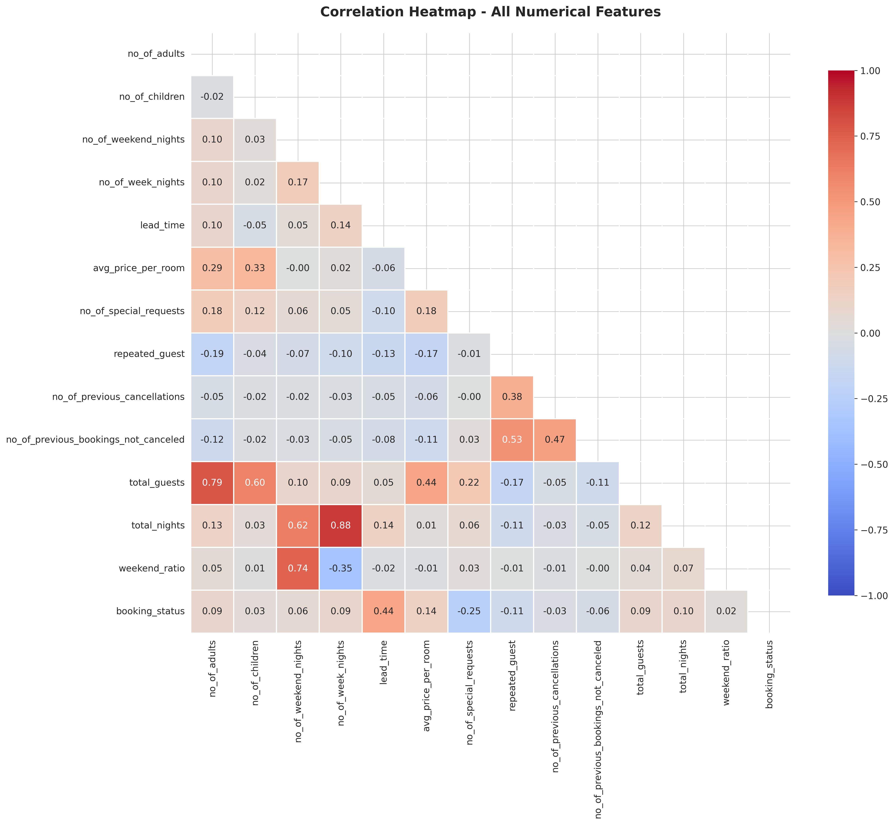
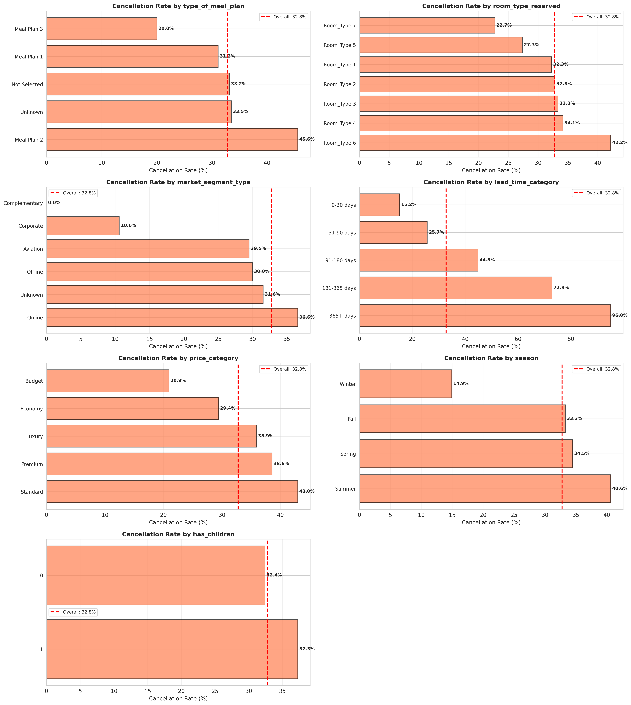
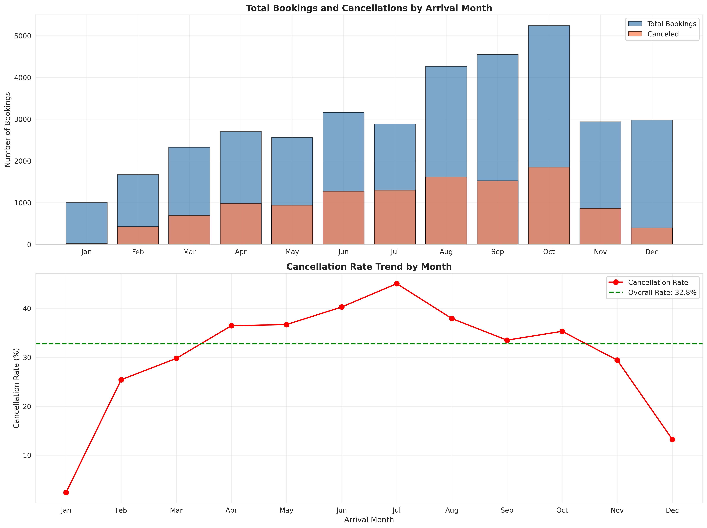

# 🏨 Hotel Booking Cancellation Analysis

> *Identifying $4.2M revenue opportunity through data-driven insights*

[](https://www.python.org/)
[](https://pandas.pydata.org/)
[](https://jupyter.org/)
[](https://plotly.com/)
[](LICENSE)

**[📊 View Live Dashboard](dashboards/interactive_dashboard.html)** | **[📓 Full Analysis Notebook](notebooks/01_exploratory_data_analysis.ipynb)** | **[📈 Business Recommendations](reports/Business_Recommendations.md)**

---

## 📋 Project Overview

This comprehensive exploratory data analysis (EDA) examines **36,274 hotel booking records** to identify key drivers of cancellations and provide actionable business recommendations. Through advanced statistical analysis and feature engineering, this project reveals insights that could recover **$400K-600K annually** through targeted interventions.

### 🎯 Key Findings

- **32.76% cancellation rate** resulting in **$4.2M revenue loss** (38% of potential revenue)
- **Lead Time** is the #1 driver (correlation: 0.44) - bookings 365+ days advance have **59.8% cancellation**
- **Special Requests** reduce cancellations by **2.5x** - powerful commitment indicator
- **Market Segment** analysis reveals Corporate segment has only **10.6% cancellation** vs Online's **36.6%**
- **Seasonal patterns**: Summer shows **40.6% cancellation** vs Winter's **14.9%**

### 💡 Business Impact

Implementing the prioritized recommendations could:
- Reduce cancellation rate by **10-15%**
- Recover **$400K-600K in annual revenue**
- Improve demand forecasting accuracy
- Optimize pricing and cancellation policies

---

## 🎨 Dashboard Preview



### Interactive Features

- 📊 **4 Tab Navigation**: Overview, Key Drivers, Time Trends, Business Insights
- 📈 **10+ Interactive Charts**: Hover tooltips, zoom, pan, download
- 💰 **Revenue Impact Calculator**: Quantified business value
- 🎯 **Priority Recommendations**: Actionable insights with ROI estimates

**[🚀 Launch Interactive Dashboard](https://YOUR_USERNAME.github.io/hotel-booking-cancellation-analysis/)**

---

## 📊 Key Visualizations

<table>
  <tr>
    <td></td>
    <td></td>
  </tr>
  <tr>
    <td align="center"><b>Cancellation Distribution</b></td>
    <td align="center"><b>Feature Correlations</b></td>
  </tr>
  <tr>
    <td></td>
    <td></td>
  </tr>
  <tr>
    <td align="center"><b>Cancellation Drivers</b></td>
    <td align="center"><b>Seasonal Patterns</b></td>
  </tr>
</table>

---

## 🛠️ Tech Stack

**Languages & Libraries:**
- Python 3.8+
- Pandas, NumPy (Data manipulation)
- Matplotlib, Seaborn, Plotly (Visualization)
- SciPy (Statistical analysis)

**Interactive Dashboards:**
- React.js (Component-based dashboard)
- Plotly.js (Interactive HTML dashboard)
- HTML5/CSS3/JavaScript

**Tools:**
- Jupyter Notebook (Analysis environment)
- Git/GitHub (Version control)
- GitHub Pages (Dashboard hosting)

---

## 📁 Repository Structure

```
hotel-booking-cancellation-analysis/
├── data/
│   ├── raw/                          # Original dataset
│   └── processed/                    # Cleaned dataset
├── notebooks/
│   └── 01_exploratory_data_analysis.ipynb  # Main analysis
├── dashboards/
│   ├── interactive_dashboard.html    # Standalone dashboard
│   └── react_dashboard.jsx           # React component
├── reports/
│   ├── Enhanced_EDA_Report.md        # Written analysis
│   ├── Business_Recommendations.md   # Executive summary
│   └── figures/                      # All visualizations
├── src/
│   ├── data_cleaning.py              # Data preprocessing
│   ├── feature_engineering.py        # Feature creation
│   └── visualization.py              # Plotting functions
└── docs/
    ├── methodology.md                # Technical documentation
    └── data_dictionary.md            # Feature descriptions
```

---

## 🚀 Getting Started

### Prerequisites

- Python 3.8 or higher
- pip (Python package manager)
- Jupyter Notebook

### Installation

1. **Clone the repository**
   ```bash
   git clone https://github.com/YOUR_USERNAME/hotel-booking-cancellation-analysis.git
   cd hotel-booking-cancellation-analysis
   ```

2. **Install required packages**
   ```bash
   pip install -r requirements.txt
   ```

3. **Launch Jupyter Notebook**
   ```bash
   jupyter notebook
   ```

4. **Open the main analysis**
   - Navigate to `notebooks/01_exploratory_data_analysis.ipynb`
   - Run all cells (Cell → Run All)

### Quick Start

**View the interactive dashboard locally:**
```bash
# Option 1: Open HTML directly
open dashboards/interactive_dashboard.html

# Option 2: Serve locally
cd dashboards
python -m http.server 8000
# Visit: http://localhost:8000/interactive_dashboard.html
```

---

## 📊 Analysis Methodology

### 1. Data Quality Assessment
- Identified and removed 1 row with 17/19 missing values
- Strategic imputation for missing data (7.15% parking, 4.17% segment, 3.23% room type)
- No duplicate records found

### 2. Feature Engineering
Created 8 new features:
- `total_guests` = adults + children
- `total_nights` = weekend + week nights
- `weekend_ratio` = weekend / total nights
- `price_per_person_night` = price / (guests × nights)
- `has_children` = binary flag
- `lead_time_category` = 5 time-based bins
- `price_category` = 5 price-based bins
- `season` = Winter/Spring/Summer/Fall

### 3. Statistical Validation
- **T-tests**: All numerical features vs cancellation (p < 0.001)
- **Chi-square tests**: All categorical features vs cancellation (p < 0.001)
- **Correlation analysis**: Full correlation matrix with 14 features
- **Outlier detection**: IQR method across all numerical variables

### 4. Multivariate Analysis
- Temporal patterns (monthly, seasonal)
- Market segment performance
- Price sensitivity analysis
- Guest behavior patterns

---

## 🎯 Top 4 Cancellation Drivers

### 🥇 #1: Lead Time (Correlation: 0.44)
- **Finding**: Each 30-day increase in lead time raises cancellation risk by 5-10%
- **Impact**: 365+ day bookings have 59.8% cancellation vs 14.9% for 0-30 days
- **Recommendation**: Require deposits for bookings >90 days advance

### 🥈 #2: Special Requests (Correlation: -0.25)
- **Finding**: Guests making requests are 2.5x more committed
- **Impact**: 42.7% cancellation with 0 requests vs 15-20% with 1+ requests
- **Recommendation**: Actively encourage special requests during booking

### 🥉 #3: Market Segment (Chi-square: p < 0.001)
- **Finding**: Corporate segment is most reliable
- **Impact**: Corporate 10.6% vs Online 36.6% cancellation
- **Recommendation**: Develop targeted corporate booking programs

### 🏅 #4: Price Category (Correlation: 0.14)
- **Finding**: Premium rooms have higher cancellation rates
- **Impact**: Budget <$75: 10.2%, Luxury >$150: 49.2% cancellation
- **Recommendation**: Dynamic cancellation policies by price tier

---

## 💼 Business Recommendations

### 🔴 High Priority (Implement Immediately)

1. **Deposit Policy for Long Lead Times**
   - Require deposits for bookings >90 days in advance
   - Expected impact: 15-20% reduction in long-lead cancellations
   - Implementation time: 1-2 weeks

2. **Encourage Special Requests**
   - Add prominent UI prompts during checkout
   - Expected impact: 10-15% overall reduction
   - Implementation time: 1 week

3. **Dynamic Cancellation Policies**
   - Stricter policies for summer, flexible for winter
   - By lead time and market segment
   - Expected impact: 5-10% seasonal improvement
   - Implementation time: 2-4 weeks

4. **Re-engagement Email Campaigns**
   - Automated emails at 60/30/14 days before arrival
   - Expected impact: 5-8% reduction
   - Implementation time: 1-2 weeks

**Combined Expected Impact**: $400K-600K annual revenue recovery

### 🟡 Medium Priority (3-6 months)
- Corporate booking program expansion
- Summer-specific non-refundable pricing
- Premium customer loyalty rewards
- Airline partnership bundles

### 🟢 Low Priority (Long-term)
- Predictive cancellation ML model
- Dynamic overbooking algorithm
- Advanced customer segmentation

📄 **[View Full Recommendations Report](reports/Business_Recommendations.md)**

---

## 📈 Results Summary

| Metric | Value |
|--------|-------|
| Total Bookings Analyzed | 36,274 |
| Overall Cancellation Rate | 32.76% |
| Revenue Loss | $4.2M (38% of potential) |
| Features Engineered | 8 new features |
| Statistical Tests Performed | 15+ (all p < 0.001) |
| Visualizations Created | 20+ professional charts |
| Estimated Revenue Recovery | $400K-600K annually |

---

## 🔍 Data Dictionary

| Feature | Description | Type |
|---------|-------------|------|
| `Booking_ID` | Unique booking identifier | String |
| `no_of_adults` | Number of adults in booking | Integer |
| `no_of_children` | Number of children in booking | Integer |
| `no_of_weekend_nights` | Weekend nights booked | Integer |
| `no_of_week_nights` | Weekday nights booked | Integer |
| `type_of_meal_plan` | Meal plan type | Categorical |
| `required_car_parking_space` | Parking required (0/1) | Binary |
| `room_type_reserved` | Room type code | Categorical |
| `lead_time` | Days between booking and arrival | Integer |
| `arrival_year` | Year of arrival | Integer |
| `arrival_month` | Month of arrival | Integer |
| `arrival_date` | Date of month | Integer |
| `market_segment_type` | Booking channel | Categorical |
| `repeated_guest` | Previous guest (0/1) | Binary |
| `no_of_previous_cancellations` | Prior cancellations | Integer |
| `no_of_previous_bookings_not_canceled` | Prior completed bookings | Integer |
| `avg_price_per_room` | Room price | Float |
| `no_of_special_requests` | Number of special requests | Integer |
| `booking_status` | Canceled (1) or Not (0) | Binary (Target) |

**Engineered Features**: See [Full Data Dictionary](docs/data_dictionary.md)

---

## 🎓 Skills Demonstrated

This project showcases proficiency in:

✅ **Data Science Workflow**
- End-to-end EDA from raw data to insights
- Reproducible analysis with clear documentation
- Professional-grade visualizations

✅ **Statistical Analysis**
- Hypothesis testing (t-tests, chi-square)
- Correlation analysis
- Distribution analysis
- Outlier detection

✅ **Feature Engineering**
- Domain knowledge application
- Creating meaningful derived features
- Feature validation

✅ **Data Visualization**
- Static visualizations (Matplotlib, Seaborn)
- Interactive dashboards (Plotly, React)
- Effective visual communication

✅ **Business Acumen**
- Translating data insights to business value
- ROI quantification
- Prioritized recommendations
- Executive-level communication

✅ **Technical Documentation**
- Clear README and methodology docs
- Well-commented code
- Reproducible workflows

---

## 📚 Future Enhancements

- [ ] Build predictive ML model for cancellation probability
- [ ] Create real-time dashboard with API integration
- [ ] Implement A/B testing framework for recommendations
- [ ] Add customer segmentation using clustering
- [ ] Deploy model as REST API
- [ ] Create mobile-responsive dashboard

---

## 🤝 Contributing

Contributions, issues, and feature requests are welcome!

1. Fork the repository
2. Create your feature branch (`git checkout -b feature/AmazingFeature`)
3. Commit your changes (`git commit -m 'Add some AmazingFeature'`)
4. Push to the branch (`git push origin feature/AmazingFeature`)
5. Open a Pull Request

---

## 📝 License

This project is licensed under the MIT License - see the [LICENSE](LICENSE) file for details.

---

## 👤 Author

**Your Name**

- GitHub: [@YOUR_USERNAME](https://github.com/YOUR_USERNAME)
- LinkedIn: [Your LinkedIn](https://linkedin.com/in/YOUR_PROFILE)
- Portfolio: [Your Portfolio Website](https://yourwebsite.com)
- Email: your.email@example.com

---

## 🙏 Acknowledgments

- Dataset source: [Kaggle Hotel Booking Dataset](https://www.kaggle.com/)
- Inspired by real-world hospitality industry challenges
- Built as part of data science portfolio development

---

## 📞 Contact

Have questions or want to collaborate? Feel free to reach out!

**[📧 Send Email](mailto:your.email@example.com)** | **[💼 LinkedIn](https://linkedin.com/in/YOUR_PROFILE)** | **[🐦 Twitter](https://twitter.com/YOUR_HANDLE)**

---

<div align="center">

### ⭐ Star this repository if you found it helpful!

**[📊 View Live Dashboard](https://YOUR_USERNAME.github.io/hotel-booking-cancellation-analysis/)** | **[📓 Explore Analysis](notebooks/01_exploratory_data_analysis.ipynb)**

*Built with ❤️ using Python, Pandas, and Plotly*

</div>
